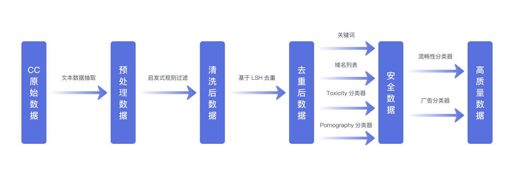

# 万卷-CC
[English🌎](./README.md)|**简体中文**🀄 


## 万卷-CC

万卷-CC(Wanjuan-CC) 是从CommonCrawl获取的一个 1T Tokens 的高质量英文网络文本数据集。结果显示，与各类开源英文CC语料在 Perspective API 不同维度的评估上，WanJuan-CC都表现出更高的安全性。此外，通过在4个验证集上的困惑度（PPL）和6下游任务的准确率，也展示了WanJuan-CC的实用性。WanJuan-CC在各种验证集上的PPL表现出竞争力，特别是在要求更高语言流畅性的tiny-storys等集上。通过与同类型数据集进行1B模型训练对比，使用验证数据集的困惑度（perplexity）和下游任务的准确率作为评估指标，实验证明，WanJuan-CC显著提升了英文文本补全和通用英文能力任务的性能。


## 数据处理方法

### 处理流程简述

在WanJuan-CC数据集的准备阶段，OpenDataLab团队搭建了一个高性能分布式数据处理框架进行数据的处理，具体的数据处理流程如图所示：


<p align="center">
<b>
Wanjuan-CC数据处理流程图
</b>
</p>

1. 从Common Crawl的WARC格式数据中提取文本，得到"原始数据"（Raw data）。
2. 通过启发式规则对原始数据进行过滤，生成"清洗数据"（Clean data）。
3. 利用基于LSH的去重方法对清洗数据进行处理，得到"无重复数据"（Dedup data）。
4. 使用基于关键词和域名列表的过滤方法，以及基于Bert的有害内容分类器和淫秽内容分类器对无重复数据进行过滤，产生"安全数据"（Safe data）。
5. 采用基于Bert的广告分类器和流畅性分类器对安全数据进行进一步过滤，得到"高质量数据"（High-Quality data）。

### 各步骤数据留存率

我们统计了各个步骤的文档数量，并绘制了各数据处理步骤的相对去除率与绝对留存率，如下图所示：

<p align="center">
<b>
Wanjuan-CC数据处理流程相对去除率和绝对留存率
</b>
</p>

## 数据信息

### 基本信息
- 数据模态：纯文本数据；
- 主要语言：英文；
- 数据量：约 100B Tokens；
- 数据格式：以Jsonlines形式存储的语料文本与附加信息。

### 数据样例

```json
{
    "id": "Bk3aTI85qrqB0ZWjQ26l",
    "content": "This year I have been overwhelmed by moving house. The planning and organising has dominated my life: packing and unpacking boxes, trying to keep the family fed and watered, being there 100% for my children to settle in. My life - my aims and goals - have taken second place to the family chaos.\nYesterday, for the first time in ages, I sat down and thought: I want to write my book. I want to get this back into my time schedule. I want to make this space for me, for expressing myself, for being creative.\nSo what happens as of 3.15pm tomorrow? School holidays. Am I really likely to get a moment's peace?\nNow I'm planning: take the laptop on holiday. Work out how to blog from mobile (have to confess this is highly unlikely to work!) Consider booking children into holiday camps for entire 5 weeks. (Would Grannie like them?) Insist on a couple of hours a day, uninterrupted, simply to write.\nOr ... accept the reality. Enjoy the children while they are still prepared to tolerate me. Plan for a solid routine when term starts in September.\nWhich do you think will win?",
    "title": "Withenay Wanders: July 2009",
    "language": "en",
    "date": "2018-06-18T18: 54: 52Z",
    "token_num": 244,
    "cbytes_num": 1073,
    "line_num": 6,
    "char_num": 1073,
    "toxic_score": 0.001661,
    "porn_score": 0.003416,
    "fluency_score": 0.998535,
    "not_ad_score": 0.981934
}
```

### 数据字段格式

以下表格记录了数据各字段的字段名，意义，数据类型和取值说明：

| 字段名 | 意义 | 数据类型 |取值说明|
| --- | --- | --- | --- |
| id | 唯一标识符 | string |全局唯一标识|
| content | 正文内容 | string |此字段用于预训练|
| title | 标题 | string |网页标题|
| language | 语言 | string | "en" |
| date | 数据日期 | string | "2018-06-18T18: 54: 52Z" |
| token_num | content的token大小 | int | 正整数 |
| cbytes_num | content的字节大小 | int | 正整数 |
| line_num | content的行数，以\n分隔 | int | 正整数 |
| char_num | content的字符大小 | int | 正整数 |
| toxic_score | 毒性评分 | float |[0.0~1.0]，高表示毒性可能性高|
| porn_score | 色情评分 | float |[0.0~1.0]，高表示色情可能性高|
| fluency_score | 流畅性评分 | float |[0.0~1.0]，高表示流畅性好|
| not_ad_score | 非广告评分 | float |[0.0~1.0]，高表示非广告可能性高|

### 年份分布

我们统计了WanJuan-CC数据集中文档数量，存储空间和Token数量的年份分布，如下图所示：

<p align="center">
<b>
Wanjuan-CC数据集年份分布
</b>
</p>

### 数据统计信息分布

我们使用了一些统计指标来描述WanJuan-CC数据集的一些基本信息，并绘制了百分比直方图如下所示：

<p align="center">
<b>
Wanjuan-CC数据集统计信息分布
</b>
</p>

## 下载与解压

1. 通过用户界面下载数据：
    - 点击[数据集文件](https://opendatalab.com/OpenDataLab/WanJuanCC/tree/main)，即可查看此数据集中所有的文件列表，勾选所需文件，然后点击"下载"按钮即可完成下载。
2. 通过CLI、PythonSDK下载数据：
    - 点击[CLI/SDK下载](https://opendatalab.com/OpenDataLab/WanJuanCC/cli/main)，即可查看下载代码，使用 CLI 或 Python SDK 进行数据下载操作。

## 许可

wanjuan-cc整体采用CC BY 4.0许可协议。您可以自由共享、改编该数据集，唯需遵循以下条件：
- 署名：您必须适当地标明作者、提供指向本协议的链接，以及指明是否（对原始数据集）做了修改。您可以以任何合理的方式这样做，但不能以任何方式暗示许可人同意您或您的使用。
- 没有附加限制：您不得使用法律条款或技术措施来限制他人执行许可证允许的任何操作。
完整协议内容，请访问[CC BY 4.0](https://creativecommons.org/licenses/by/4.0/)协议全文。

## 特别注意事项

请注意，本数据集的某些子集可能受制于其他协议规定。在使用特定子集之前，请务必仔细阅读相关协议，确保合规使用。更为详细的协议信息，请在特定子集的相关文档或元数据中查看。

OpenDataLab作为非盈利机构，倡导和谐友好的开源交流环境，若在开源数据集内发现有侵犯您合法权益的内容，可发送邮件至（[OpenDataLab@pjlab.org.cn](mailto:OpenDataLab@pjlab.org.cn)），邮件中请写明侵权相关事实的详细描述并向我们提供相关的权属证明资料。我们将于3个工作日内启动调查处理机制，并采取必要的措施进行处置（如下架相关数据）。但您应确保您投诉的真实性，否则采取措施后所产生的不利后果应由您独立承担。