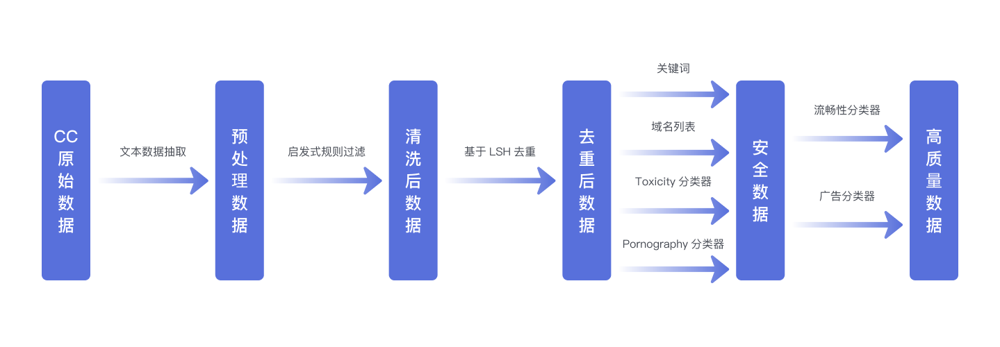
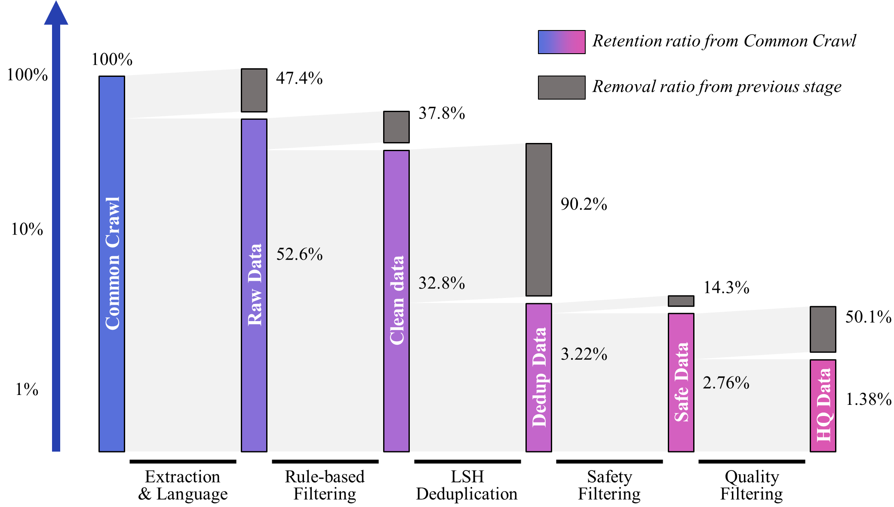
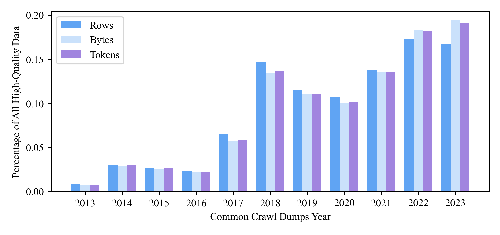
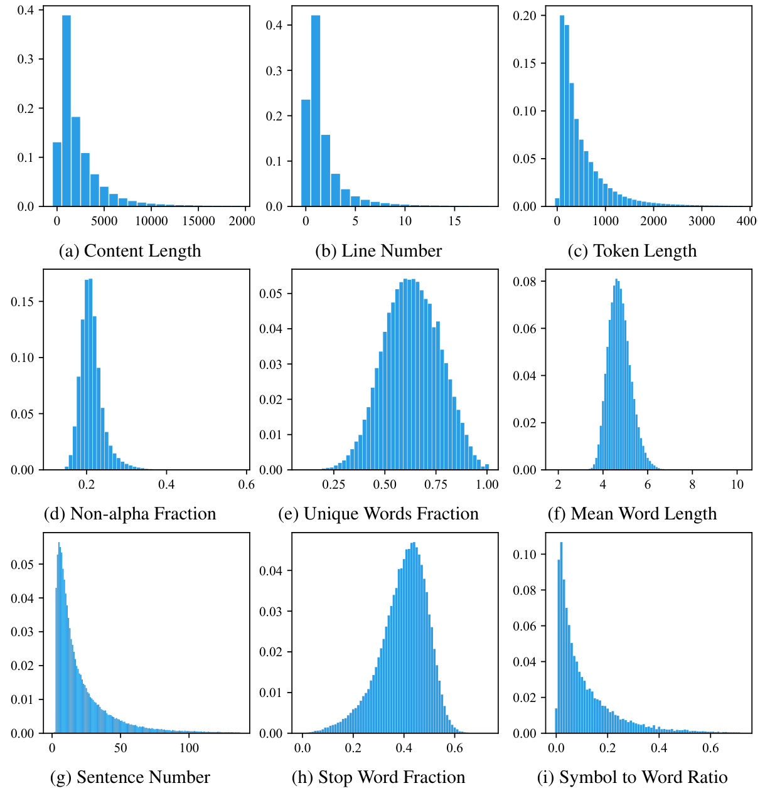

# Wanjuan-CC
 **English**🌎|[简体中文](./README-zh.md)🀄 


## Wanjuan-CC

Wanjuan-CC(万卷-CC) is a high-quality English web text dataset efficiently extracted from CommonCrawl, consisting of 1.0T tokens. The results show that compared with various open-source English CC corpora evaluated on different dimensions of the Perspective API, WanJuan-CC exhibits higher safety. Moreover, its practicality is demonstrated through perplexity (PPL) on four validation sets and accuracy on six downstream tasks. WanJuan-CC shows competitive PPL performance on various validation sets, especially on sets like tiny-storys that require higher language fluency. By comparing with similar datasets in 1B model training, using the perplexity of the validation dataset and the accuracy of downstream tasks as evaluation indicators, it has been experimentally proven that WanJuan-CC significantly improves the performance of English text completion and general English ability tasks.

## Data Processing Method

### Brief Description of the Process

In the preparation phase of the WanJuan-CC dataset, the OpenDataLab team built a high-performance distributed data processing framework for data processing. The specific data processing flow is shown in the figure:


<p align="center">
<b>
Wanjuan-CC data processing flow
</b>
</p>

1. Extract text from the WARC format data of Common Crawl to obtain "Raw data".
2. Filter the raw data through heuristic rules to generate "Clean data".
3. Process the clean data using an LSH-based deduplication method to get "Dedup data".
4. Filter the dedup data using a filtering method based on keyword and domain lists, as well as a harmful content classifier and obscene content classifier based on Bert, to produce "Safe data".
5. Further filter the safe data using a Bert-based ad classifier and fluency classifier to get "High-Quality data".

### Data Retention Rate at Each Step

We have counted the number of documents at each step and plotted the relative removal rate and absolute retention rate of each data processing step, as shown in the figure:

<p align="center">
<b>
Wanjuan-CC data processing flow relative removal rate and absolute retention rate
</b>
</p>

## Data Information

### Basic Information
- Data modality: Pure text data;
- Main language: English;
- Data volume: Approximately 100B Tokens;
- Data format: Corpus text and additional information stored in Jsonlines format.

### Data Example

```json
{
    "id": "Bk3aTI85qrqB0ZWjQ26l",
    "content": "This year I have been overwhelmed by moving house. The planning and organising has dominated my life: packing and unpacking boxes, trying to keep the family fed and watered, being there 100% for my children to settle in. My life - my aims and goals - have taken second place to the family chaos.\nYesterday, for the first time in ages, I sat down and thought: I want to write my book. I want to get this back into my time schedule. I want to make this space for me, for expressing myself, for being creative.\nSo what happens as of 3.15pm tomorrow? School holidays. Am I really likely to get a moment's peace?\nNow I'm planning: take the laptop on holiday. Work out how to blog from mobile (have to confess this is highly unlikely to work!) Consider booking children into holiday camps for entire 5 weeks. (Would Grannie like them?) Insist on a couple of hours a day, uninterrupted, simply to write.\nOr ... accept the reality. Enjoy the children while they are still prepared to tolerate me. Plan for a solid routine when term starts in September.\nWhich do you think will win?",
    "title": "Withenay Wanders: July 2009",
    "language": "en",
    "date": "2018-06-18T18:54:52Z",
    "token_num": 244,
    "cbytes_num": 1073,
    "line_num": 6,
    "char_num": 1073,
    "toxic_score": 0.001661,
    "porn_score": 0.003416,
    "fluency_score": 0.998535,
    "not_ad_score": 0.981934
}
```

### Data Field Format

The following table records the field names, meanings, data types, and value descriptions of each field:

| Field Name | Meaning | Data Type |Value Description|
| --- | --- | --- | --- |
| id | Unique Identifier | string |Globally unique identifier|
| content | Text Content | string |This field is used for pre-training|
| title | Title | string |Web page title|
| language | Language | string | "en" |
| date | Data Date | string | "2018-06-18T18:54:52Z" |
| token_num | Token size of content | int | Positive integer |
| cbytes_num | Byte size of content | int | Positive integer |
| line_num | Number of lines in content, separated by \n | int | Positive integer |
| char_num | Character size of content | int | Positive integer |
| toxic_score | Toxicity Score | float |[0.0~1.0], higher indicates higher likelihood of toxicity|
| porn_score | Pornography Score | float |[0.0~1.0], higher indicates higher likelihood of pornography|
| fluency_score | Fluency Score | float |[0.0~1.0], higher indicates better fluency|
| not_ad_score | Non-ad Score | float |[0.0~1.0], higher indicates higher likelihood of non-ad|

### Yearly Distribution

We have counted the yearly distribution of document numbers, storage space, and token numbers in the WanJuan-CC dataset, as shown in the figure:

<p align="center">
<b>
Wanjuan-CC dataset yearly distribution
</b>
</p>


### Data Statistics Information Distribution

We used some statistical indicators to describe some basic information of the WanJuan-CC dataset and plotted a percentage histogram as shown below:

<p align="center">
<b>
Wanjuan-CC dataset statistics information distribution
</b>
</p>

## Download and Decompression

1. Download data through the user interface:
    - Click on [dataset files](https://opendatalab.com/OpenDataLab/WanJuanCC/tree/main) to view all file lists in this dataset, select the required files, and then click the "Download" button to complete the download.
2. Download data through CLI, PythonSDK:
    - Click on [CLI/SDK download](https://opendatalab.com/OpenDataLab/WanJuanCC/cli/main) to view the download code, use CLI or Python SDK to perform data download operations.

## License

wanjuan-cc as a whole adopts the CC BY 4.0 license agreement. You can freely share and adapt this dataset, but you must comply with the following conditions:
- Attribution: You must appropriately acknowledge the author, provide a link to this license, and indicate whether changes were made to the original dataset. You may do so in any reasonable manner, but not in any way that suggests the licensor endorses you or your use.
- No additional restrictions — You may not apply legal terms or technological measures that legally restrict others from doing anything the license permits.
  
For the full license content, please visit [CC BY 4.0](https://creativecommons.org/licenses/by/4.0/).

## Special Notes

Please note that some subsets of this dataset may be subject to other agreement provisions. Before using a specific subset, please read the relevant agreement carefully to ensure compliant use. For more detailed agreement information, please check the relevant documents or metadata of the specific subset.

OpenDataLab, as a non-profit organization, advocates a harmonious and friendly open-source exchange environment. If you find content in the open-source dataset that infringes your legal rights, you can send an email to [OpenDataLab@pjlab.org.cn](mailto:OpenDataLab@pjlab.org.cn). Please provide a detailed description of the infringement-related facts in the email and provide us with relevant ownership proof materials. We will initiate an investigation and handling mechanism within 3 working days and take necessary measures (such as delisting related data). However, you should ensure the authenticity of your complaint, otherwise, you should bear the adverse consequences caused by taking measures independently.
